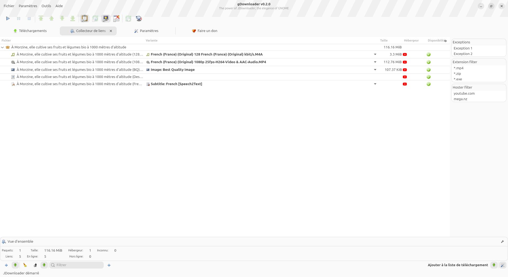
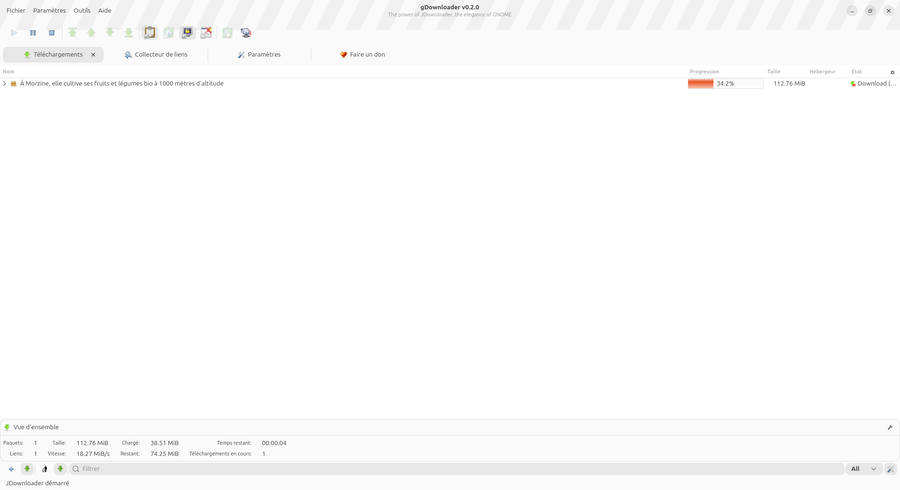
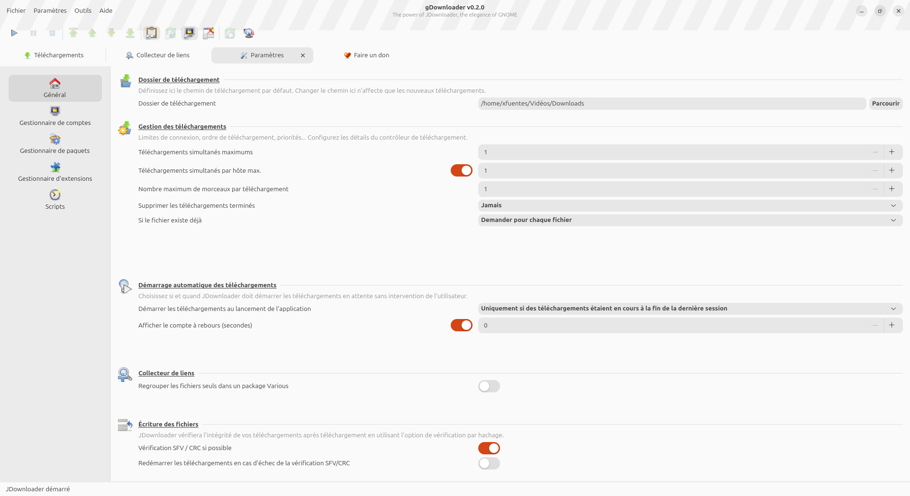

<p align="center">
  
</p>

<h1 align="center">gDownloader</h1>
<p align="center"><em>The power of JDownloader, the elegance of GNOME.</em></p>

<p align="center">
  <a href="https://github.com/xfuentes/gDownloader/actions/workflows/build-linux.yml"></a>
  <a href="https://github.com/xfuentes/gDownloader/releases"></a>
  
</p>

gDownloader is a native GTK4/[libadwaita](https://gnome.pages.gitlab.gnome.org/libadwaita/) front-end
for [JDownloader](https://jdownloader.org/), built in Rust. It drives a bundled JDownloader engine in
the background and exposes it through a clean, modern GNOME interface, instead of JDownloader's own
Swing-based UI.

#### Core Features

- **Link Grabber:** collect and inspect links before downloading, with per-link variant selection
  (e.g. video resolution/format on YouTube and similar hosts) and an expandable package/link tree.
- **Downloads Manager:** sortable/toggleable columns, a properties panel for the current selection,
  and full control over active downloads (start/pause/stop, reordering, priorities).
- **Account Manager:** manage premium hoster accounts, with automatically fetched hoster favicons.
- **Package Manager (Packagizer):** rules that automatically set download settings (destination,
  auto-extract, auto-start...) based on a package or file's properties.
- **Extension Manager & Scripts:** manage JDownloader extensions and run JavaScript automatically
  when a chosen event occurs (Eventscripter).
- **Clipboard Monitoring:** automatically detects and captures links copied to the clipboard, mirroring
  JDownloader's own detection behavior.
- **System Tray Integration:** native tray icon and desktop notifications (downloads complete, new
  links captured).
- **Multilingual:** available in 23 languages.

## Screenshots

<p align="center">
  <br>
  <sub>Link Grabber — inspect and select link variants before downloading</sub>
</p>

<p align="center">
  <br>
  <sub>Downloads — track active transfers</sub>
</p>

<p align="center">
  <br>
  <sub>Settings — fine-tune download behavior</sub>
</p>

## Requirements

- Linux with GTK4 and libadwaita installed.
- A Java runtime (JRE), used to run the bundled JDownloader engine.

## Installation

### APT (Debian / Ubuntu)

A personal APT repository is updated automatically whenever a new version
is released:

```shell
curl -fsSL https://apt.serviam.cc/serviam-apt-repo.gpg.key | sudo gpg --dearmor -o /usr/share/keyrings/serviam-apt-repo.gpg
echo "deb [signed-by=/usr/share/keyrings/serviam-apt-repo.gpg] https://apt.serviam.cc stable main" | sudo tee /etc/apt/sources.list.d/serviam-apt-repo.list
sudo apt update
sudo apt install gdownloader
```

### From a release

Alternatively, download the `.deb` package for your architecture (amd64/arm64) directly from the
[Releases page](https://github.com/xfuentes/gDownloader/releases) and install it:

```shell
sudo apt install ./gdownloader_<version>_<arch>.deb
```

### Build from source

```shell
git clone https://github.com/xfuentes/gDownloader.git
cd gDownloader
cargo build --release
```

System dependencies (Debian/Ubuntu): `build-essential pkg-config libgtk-4-dev libadwaita-1-dev`.

The resulting binary is at `target/release/gdownloader`. To package it as a `.deb` yourself:

```shell
cargo install cargo-deb
cargo deb
```

## License

gDownloader is licensed under the [GPL-3.0-or-later](LICENSE).
